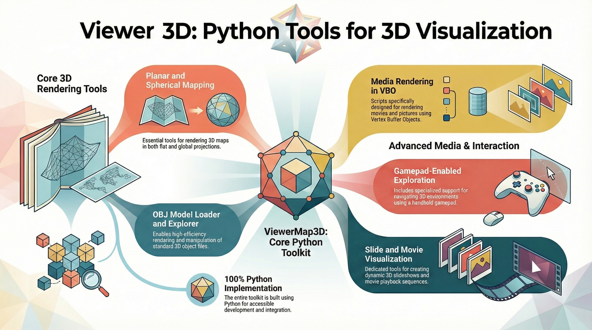
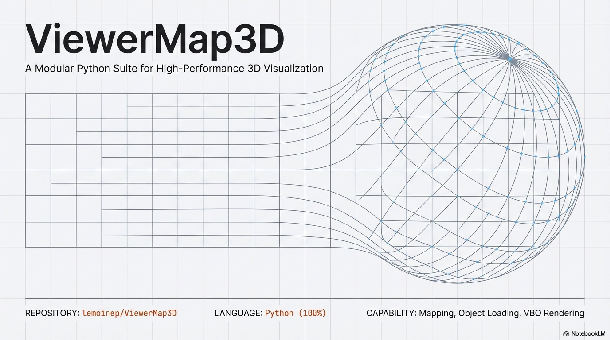
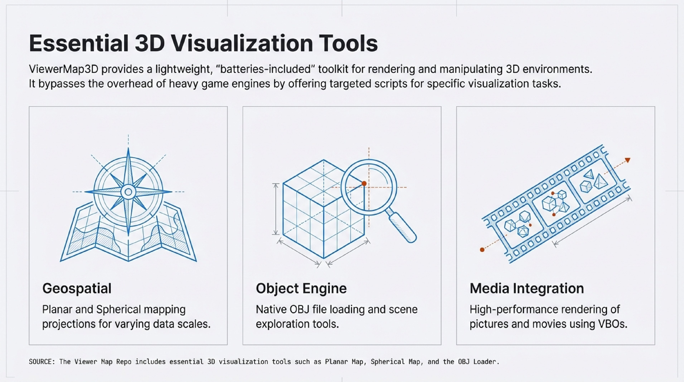
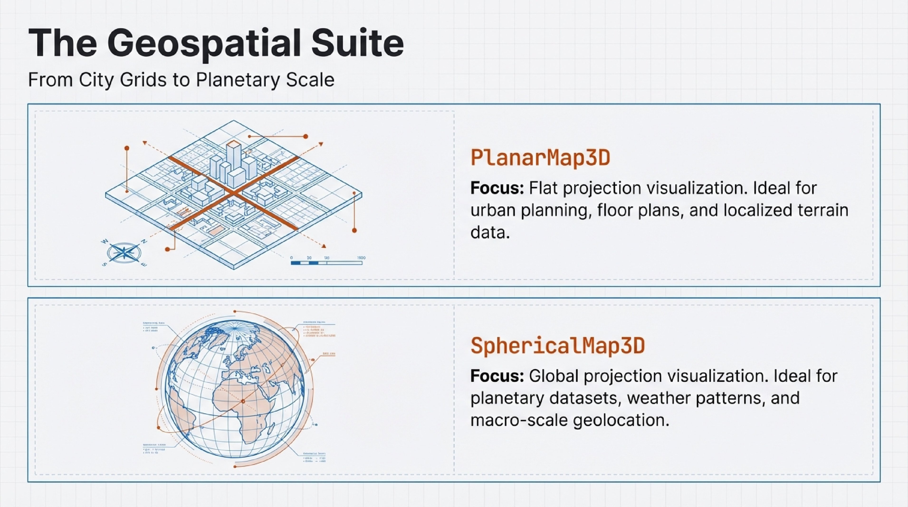
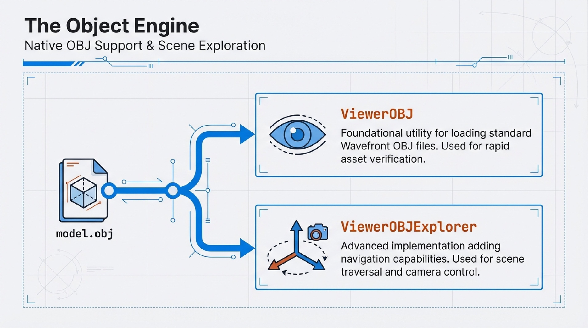
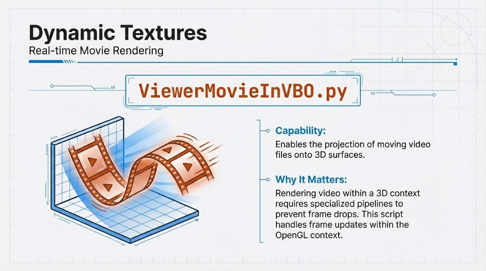
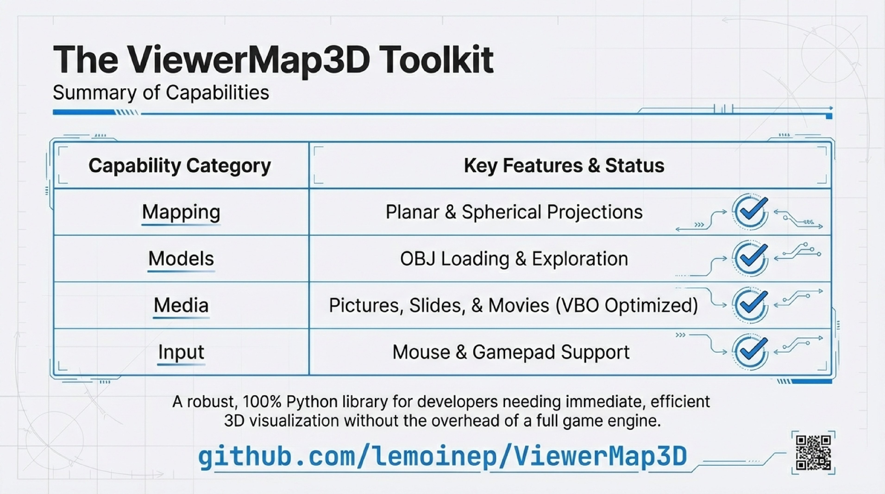

# Viewer 3D

Viewer 3D is a **collection** of lightweight 3D visualization tools written in Python for interactive viewing of maps, images, and 3D models. It provides several dedicated viewers, including planar and spherical map viewers, OBJ mesh loaders, movie and picture-in-VBO viewers, and simple slideshow utilities, each available both as Python scripts and standalone executables.  

- **PlanarMap3D.py** displays 2D maps or images projected onto a planar 3D surface with interactive camera navigation.  
- **SphericalMap3D.py** projects equirectangular or panoramic images onto a sphere to explore them as immersive 3D environments.  
- **ViewerOBJ.py** loads and renders OBJ meshes, allowing you to inspect static 3D models with basic lighting and camera controls.  
- **ViewerOBJExplorer.py** adds interactive exploration features for OBJ scenes, making it easier to navigate and inspect complex models.  
- **ViewerOBJExplorerWithGamepad.py** extends the OBJ explorer with gamepad support for more natural 3D navigation.  
- **ViewerMovieInVBO.py** plays video streams inside an OpenGL VBO, enabling real-time movie textures mapped onto simple 3D geometry.  
- **ViewerPictureInVBO.py** displays still images as textures in a VBO, useful for quickly previewing pictures mapped in 3D.  
- **ViewerSlidePictures.py** runs a simple 3D slideshow of multiple images, combining texture mapping with smooth camera or image transitions.

---
## For more information

